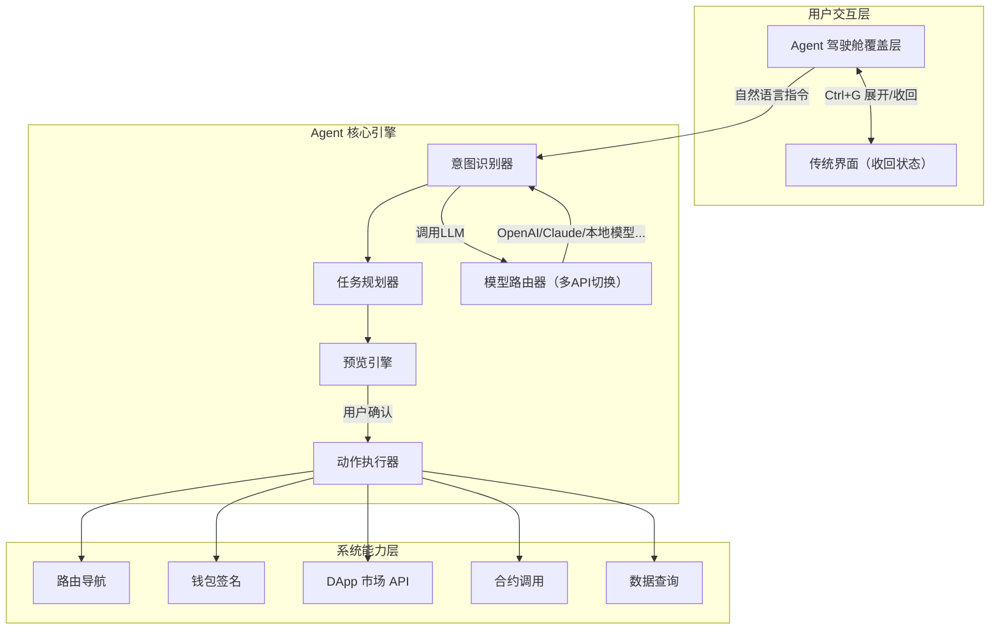
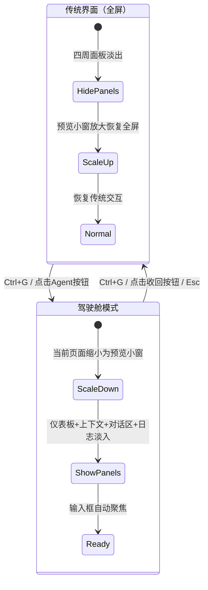
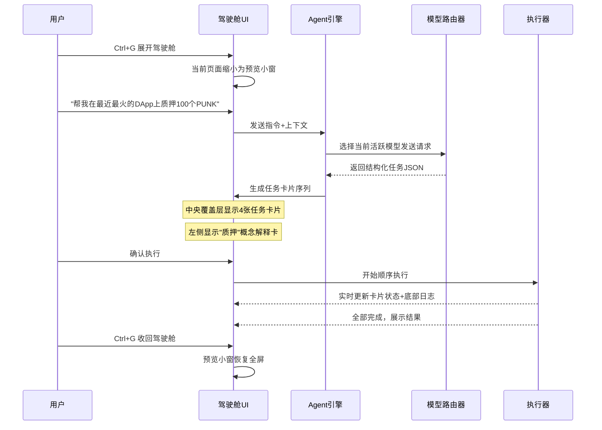

# PunkAI Agent 驾驶舱产品设计方案

## 一、设计理念与定位

**核心命题**：Agent 驾驶舱不是一个独立页面，而是**覆盖在现有界面之上的操控层**。用户随时可以一键展开驾驶舱，当前正在使用的界面缩小为中央预览小窗（保持可见、可交互），Agent 的仪表板、上下文、对话区、日志环绕在预览小窗四周。收回驾驶舱后，界面恢复到传统全屏状态，无感切换。

**与现有系统的关系**：

- **废弃** `[PunkAIFloatAssistant.vue](vite/packages/table/components/PunkAIFloatAssistant.vue)` 浮窗组件，其路由映射、意图识别等可复用逻辑迁移到新的 agent 模块
- **改造** `[MainLayout.vue](vite/packages/table/page/MainLayout.vue)`，在其外层包裹驾驶舱覆盖层
- **替代** `[aiStore](vite/packages/table/store/ai.ts)` 中的模型配置部分，升级为多模型管理

---

## 二、整体架构




---

## 三、驾驶舱展开/收回交互机制

### 3.1 触发方式

- **快捷键**：`Ctrl+G`（Global Agent）全局切换
- **底栏按钮**：在现有 `[BottomPanel](vite/packages/table/page/MainLayout.vue)` 任务栏中增加 Agent 图标按钮
- **语音唤醒**（远期预留）

### 3.2 展开动画与状态切换




### 3.3 技术实现方式

驾驶舱**不是独立路由页面**，而是在 `MainLayout.vue` 中增加一个**覆盖层组件** `AgentCockpit`：

- 展开时：给 `router-view` 区域添加 CSS `transform: scale(0.55)` + `border-radius` + 阴影，使其成为"预览小窗"的视觉效果；四周区域通过 `position: absolute` 布局
- 收回时：移除 transform，预览小窗过渡回全屏
- 预览小窗**保持完全可交互**（不是截图），用户可以在驾驶舱模式下直接操作预览窗口中的内容
- 使用 Pinia `agentStore.cockpitOpen` 控制状态

---

## 四、驾驶舱界面布局设计

整个驾驶舱分为 **五大区域**，采用深色科技风半透明主题：

```
+---------------------------------------------------------------+
|                      顶部状态仪表板                              |
|  [●在线] [模型:DeepSeek-V3 ▼] [Token:12,450] [质量:98%]       |
|  [今日:7完成/2进行] [延迟:1.2s]        [模型设置⚙] [收回 ✕]     |
+---------------+-------------------------------+---------------+
|               |                               |               |
|   左侧：      |     中央：预览小窗              |   右侧：      |
|   上下文面板   |     +任务编排覆盖层             |   对话指令区   |
|               |                               |               |
|  当前钱包:     |  ┌─────────────────────┐      |  [自然语言     |
|  0x1a2b...    |  │                     │      |   输入框]      |
|  余额: 15 ETH |  │   当前页面的缩小     │      |               |
|               |  │   实时预览           │      |  推荐指令：    |
|  当前链:       |  │   （保持可交互）      │      |  • 查看质押    |
|  PunkOS-XWK   |  │                     │      |  • 查余额      |
|               |  └─────────────────────┘      |  • 找DApp     |
|  概念解释:     |                               |               |
|  ┌──────┐    |  任务卡片浮层（有任务时显示）：   |  对话历史      |
|  │质押是  │    |  [卡片1:查询] → [卡片2:质押]   |  ...          |
|  │将代币  │    |  [确认执行] [修改] [取消]      |               |
|  │锁定... │    |                               |  快捷标签:     |
|  └──────┘    |                               |  [钱包] [市场] |
|               |                               |  [质押] [转账] |
|  最近操作:     |                               |               |
|  • 质押 50PNK |                               |               |
+---------------+-------------------------------+---------------+
|                      底部：执行日志流                            |
|  [14:32:01] 任务1完成  [14:32:03] 任务2等待签名...              |
+---------------------------------------------------------------+
```

### 各区域职责

**1. 顶部仪表板（StatusDashboard）**

- Agent 连接状态指示灯（绿色在线/红色离线/黄色重连中）
- 当前活跃模型名称（下拉可快速切换已配置的模型）
- Token 用量（已用/剩余，带进度条）
- 服务质量指标（平均响应时间、成功率百分比）
- 今日任务统计（完成/进行中/失败）
- **模型设置按钮**（打开模型管理抽屉）
- **收回按钮**（关闭驾驶舱）

**2. 左侧上下文面板（ContextPanel）**

- 当前钱包信息（地址缩写、余额、所在链名称与 Logo）
- 当前页面/DApp 上下文摘要（自动感知用户在预览小窗中浏览的内容）
- **概念解释卡片**：Agent 检测到对话或任务中涉及的专业术语时，自动在此区域展示通俗解释
- 最近操作记录（最近 5 条操作的时间线）
- 主动提示/警告区（余额不足、质押到期等）

**3. 中央预览小窗 + 任务编排覆盖层**

- **底层**：当前页面的缩小实时预览，保持完全可交互
- **覆盖层**（当 Agent 生成任务方案时浮现）：
  - 任务卡片序列，每张卡片包含：类型图标、标题、描述、预估结果、风险等级徽标
  - 卡片间的流程连接线（箭头表示执行顺序）
  - 全局操作按钮：确认执行全部 / 逐步执行 / 修改方案 / 取消
- 无任务时，中央区域只显示预览小窗

**4. 右侧对话指令区（CommandPanel）**

- **自然语言输入框**（展开驾驶舱后自动聚焦，Enter 发送）
- **智能推荐指令**（根据左侧上下文动态生成 3-5 条建议）
- **对话历史**（指令-结果摘要的精简列表，可滚动）
- **快捷标签栏**（底部固定，常用操作一键触发：钱包、市场、质押、转账等）

**5. 底部执行日志流（ExecutionLog）**

- 实时滚动显示每个任务的执行状态
- 格式：`[时间戳] 状态图标 + 简短描述`
- 可展开查看详细信息（交易哈希、返回数据等）
- 支持筛选：全部/成功/失败/进行中

---

## 五、多模型 API 配置管理

### 5.1 设计目标

用户可以配置多个大模型 API 后端，方便在不同模型之间切换以驱动 Agent。这解决了：

- 不同模型在不同任务上的优势差异（如推理型 vs 速度型）
- API 额度用完后快速切换备用模型
- 本地部署模型与云端模型共存

### 5.2 模型配置数据结构

```typescript
interface ModelProvider {
  id: string
  name: string            // 显示名，如 "DeepSeek-V3"
  baseUrl: string         // API 地址，如 "https://api.deepseek.com"
  apiKey: string          // 密钥（加密存储）
  modelName: string       // 实际模型标识，如 "deepseek-chat"
  maxTokens: number       // 最大 token 数
  temperature: number     // 默认温度
  isActive: boolean       // 是否为当前活跃模型
  status: 'untested' | 'connected' | 'failed'
  lastTestTime?: number
}
```

### 5.3 模型管理界面

点击仪表板的「模型设置」按钮后，从右侧滑出抽屉（Drawer），内容包括：

- **已配置模型列表**：卡片式展示，每张含名称、地址缩写、状态指示灯、「激活/编辑/删除」操作
- **添加新模型**：表单填写 baseUrl、apiKey、modelName 等，并提供「测试连通性」按钮
- **一键切换**：点击某个模型卡片的「激活」按钮，立即切换当前 Agent 使用的模型
- **预设模板**：内置 OpenAI、DeepSeek、Claude、通义千问、本地 Ollama 等常见配置模板，一键填充

### 5.4 与现有 aiStore 的关系

- 现有 `[aiStore](vite/packages/table/store/ai.ts)` 中 `url`、`key`、`gpt`、`temperature` 等单一模型字段 **保留兼容**，作为默认/回退配置
- 新增 `agentStore` 中的 `modelProviders: ModelProvider[]` 管理多模型列表
- Agent 核心引擎通过 `agentStore.activeModel` 获取当前应使用的模型配置

---

## 六、Agent 能力设计（功能层）

### 6.1 意图识别与任务分类

Agent 识别用户自然语言后，映射到以下**动作类型**：

- **navigate** - 页面导航（复用现有 PunkAI 的路由映射逻辑）
- **query** - 数据查询（余额、DApp 信息、合约状态等）
- **transact** - 链上交易（质押、转账、合约调用）
- **explain** - 概念解释（什么是 Gas、什么是质押等）
- **manage** - 系统管理（切换链、连接钱包、修改设置）
- **composite** - 复合任务（上述多种的组合）

### 6.2 三大核心能力

**能力一：辅助交互**

- 将复杂的区块链操作翻译为步骤化任务卡片
- 自动填充已知参数（如当前钱包地址、默认链 ID）
- 交易前展示 Gas 预估、余额检查、风险提示

**能力二：主动提示**

- 检测到用户余额不足时主动提醒（显示在左侧上下文面板）
- 质押到期/收益可领取时推送通知
- 发现潜在风险合约时警告
- 根据用户浏览历史推荐 DApp

**能力三：消除概念障碍**

- 左侧面板的「概念卡」：遇到专业术语时自动展示通俗解释
- 任务卡片内附「为什么」按钮，点击解释该步骤的意义
- 新手引导模式：首次使用某功能时自动展开教程

### 6.3 任务编排工作流




---

## 七、技术实现方案（基于现有架构）

### 7.1 新增/修改文件结构

```
vite/packages/table/
├── page/core/AgentCockpit/            # 驾驶舱组件（新增，非路由页面而是覆盖层）
│   ├── AgentCockpit.vue               # 驾驶舱主覆盖层
│   ├── StatusDashboard.vue            # 顶部仪表板
│   ├── ContextPanel.vue               # 左侧上下文面板
│   ├── TaskOrchestration.vue          # 中央任务编排覆盖层
│   ├── TaskCard.vue                   # 单个任务卡片
│   ├── CommandPanel.vue               # 右侧对话指令区
│   ├── ExecutionLog.vue               # 底部执行日志
│   └── ModelSettingsDrawer.vue        # 模型配置抽屉
├── store/
│   └── agent.ts                       # Agent 状态管理（新增）
├── js/agent/                          # Agent 核心逻辑（新增）
│   ├── intentParser.ts                # 意图识别
│   ├── taskPlanner.ts                 # 任务规划
│   ├── previewEngine.ts               # 预览引擎
│   ├── actionExecutor.ts              # 动作执行器
│   ├── modelRouter.ts                 # 模型路由器（多API切换）
│   ├── actions/                       # 各类动作实现
│   │   ├── navigateAction.ts
│   │   ├── queryAction.ts
│   │   ├── transactAction.ts
│   │   ├── explainAction.ts
│   │   └── manageAction.ts
│   └── types.ts                       # 类型定义
├── page/MainLayout.vue                # 改造：包裹 AgentCockpit 覆盖层
└── components/PunkAIFloatAssistant.vue # 删除
```

### 7.2 Agent Store 设计（`store/agent.ts`）

核心状态包含：

- **cockpitOpen**: boolean -- 驾驶舱是否展开
- **connectionStatus**: 'online' | 'offline' | 'reconnecting'
- **modelProviders**: ModelProvider[] -- 已配置的模型列表
- **activeModelId**: string -- 当前活跃模型 ID
- **tokenUsage**: { used, remaining, total }
- **serviceMetrics**: { avgLatency, successRate, todayTasks }
- **taskQueue**: TaskCard[] -- 当前编排的任务列表
- **executionLog**: LogEntry[] -- 执行日志
- **context**: { walletInfo, currentChain, currentPage, recentActions }
- **proactiveAlerts**: Alert[] -- 主动提示队列
- **conversationHistory**: Message[] -- 对话历史

持久化策略：`modelProviders`（apiKey 加密）、`conversationHistory`、`cockpitOpen` 存 localStorage。

### 7.3 MainLayout 改造

在 `[MainLayout.vue](vite/packages/table/page/MainLayout.vue)` 中：

```vue
<template>
  <div class="main-layout" :class="{ 'cockpit-mode': agentStore.cockpitOpen }">
    <!-- 驾驶舱覆盖层 -->
    <AgentCockpit v-if="agentStore.cockpitOpen" />

    <!-- 原有布局（驾驶舱模式下添加缩小 class） -->
    <div class="main-content" :class="{ 'preview-window': agentStore.cockpitOpen }">
      <TopPanel v-if="!fullScreen && !agentStore.cockpitOpen" />
      <div class="middle-area">
        <SidePanel v-if="!fullScreen && !agentStore.cockpitOpen && navigationToggle[0]" ... />
        <keep-alive><router-view /></keep-alive>
        <SidePanel v-if="!fullScreen && !agentStore.cockpitOpen && navigationToggle[1]" ... />
      </div>
      <BottomPanel v-if="!fullScreen" />  <!-- 底栏始终显示，含Agent触发按钮 -->
    </div>
  </div>
</template>
```

`preview-window` CSS class 实现缩小效果：

```css
.preview-window {
  position: absolute;
  top: 50%;
  left: 50%;
  transform: translate(-50%, -50%) scale(0.55);
  width: 100%;
  height: 100%;
  border-radius: 12px;
  box-shadow: 0 0 40px rgba(0, 200, 255, 0.15);
  overflow: hidden;
  pointer-events: auto;
  transition: transform 0.4s cubic-bezier(0.4, 0, 0.2, 1);
}
```

### 7.4 意图识别实现策略

采用**三级漏斗**（渐进式，便于开发）：

1. **本地规则匹配**：正则/关键词匹配常见指令（速度快、零成本）
2. **结构化 LLM 解析**：通过 `modelRouter` 调用当前活跃模型，非流式要求返回 JSON 格式的 TaskPlan
3. **流式对话兜底**：无法解析为任务时，进入闲聊/解释模式

LLM 解析 prompt 模板核心结构：

```
你是 PunkOS 区块链客户端的智能代理。根据用户指令，返回一个任务编排 JSON：
{
  "tasks": [
    {
      "type": "query|transact|navigate|explain|manage",
      "title": "任务标题",
      "description": "操作描述",
      "params": { ... },
      "riskLevel": "low|medium|high",
      "estimatedResult": "预估结果描述"
    }
  ],
  "summary": "整体方案摘要"
}

当前上下文：
- 钱包: {{walletAddress}}
- 链: {{chainName}}
- 余额: {{balance}}
- 当前页面: {{currentPage}}
```

### 7.5 模型路由器（`modelRouter.ts`）

```typescript
class ModelRouter {
  async chat(messages, options?) {
    const model = agentStore.activeModel
    return fetch(`${model.baseUrl}/v1/chat/completions`, {
      headers: { Authorization: `Bearer ${model.apiKey}` },
      body: JSON.stringify({
        model: model.modelName,
        messages,
        temperature: model.temperature,
        max_tokens: model.maxTokens,
        stream: options?.stream ?? false
      })
    })
  }

  async testConnection(provider: ModelProvider): Promise<boolean> { ... }
}
```

---

## 八、交互场景示例

### 场景1: 新手首次质押

用户输入: **"我想质押一些代币，但我不太懂质押是什么"**

Agent 响应:

1. 左侧面板弹出**概念卡**：质押(Staking)的通俗解释
2. 中央覆盖层展示任务卡片：
  - 卡片1: [explain] 为您展示当前可质押的 DApp 列表
  - 卡片2: [query] 查询您的可用余额
  - 卡片3: [navigate] 跳转到质押页面（预览小窗中跳转）
3. 用户确认后逐步引导

### 场景2: 复合操作

用户输入: **"查一下我的质押收益，如果超过10个PUNK就提取出来"**

Agent 响应:

- 中央覆盖层展示条件化任务编排：
  - 卡片1: [query] 查询当前质押收益
  - 卡片2: [条件分支] 若收益 > 10 PUNK -> 执行提取
  - 卡片3: [transact] 提取收益（Gas 约 0.002 ETH）
- 风险标识: 低
- 预估结果: 收益到账钱包

### 场景3: 快速切换模型

用户点击仪表板模型名称旁的下拉箭头，弹出已配置模型列表：

- DeepSeek-V3（当前）
- GPT-4o
- Claude 3.5（离线）
- 本地 Ollama-Qwen

选择「GPT-4o」后，仪表板立即更新，后续所有 Agent 请求切换到新模型。

---

## 九、实现优先级与分期

### P0 - MVP（第一期）

- AgentCockpit 覆盖层骨架 + 展开/收回动画
- MainLayout 改造（预览小窗缩放 + 底栏 Agent 按钮）
- 顶部仪表板（静态状态展示）
- 右侧对话指令面板 + 基础意图识别
- 中央任务卡片展示（静态预览）
- 导航类和查询类动作执行
- 移除 PunkAIFloatAssistant 浮窗

### P1 - 模型与交易（第二期）

- 多模型 API 配置管理（ModelSettingsDrawer）
- 模型路由器 + 连通性测试
- 交易类动作执行（集成钱包签名）
- Gas 预估和风险等级
- 执行日志流实时更新

### P2 - 智能增强（第三期）

- 左侧上下文面板智能感知
- 概念解释卡片自动生成
- 主动提示系统
- 复合任务与条件分支
- 历史任务回顾
- 服务质量监控完善

