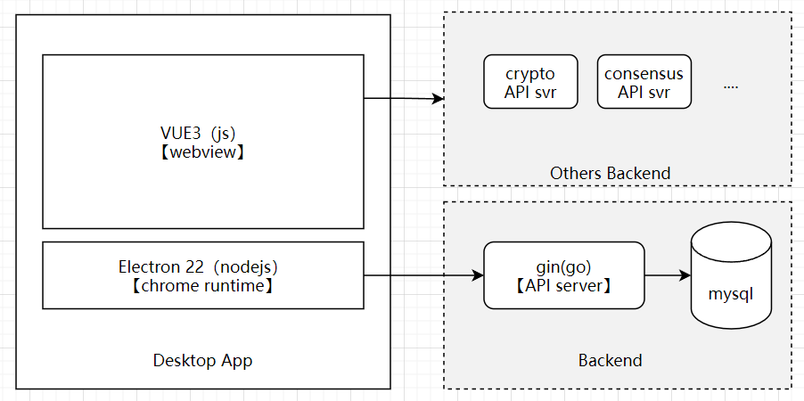
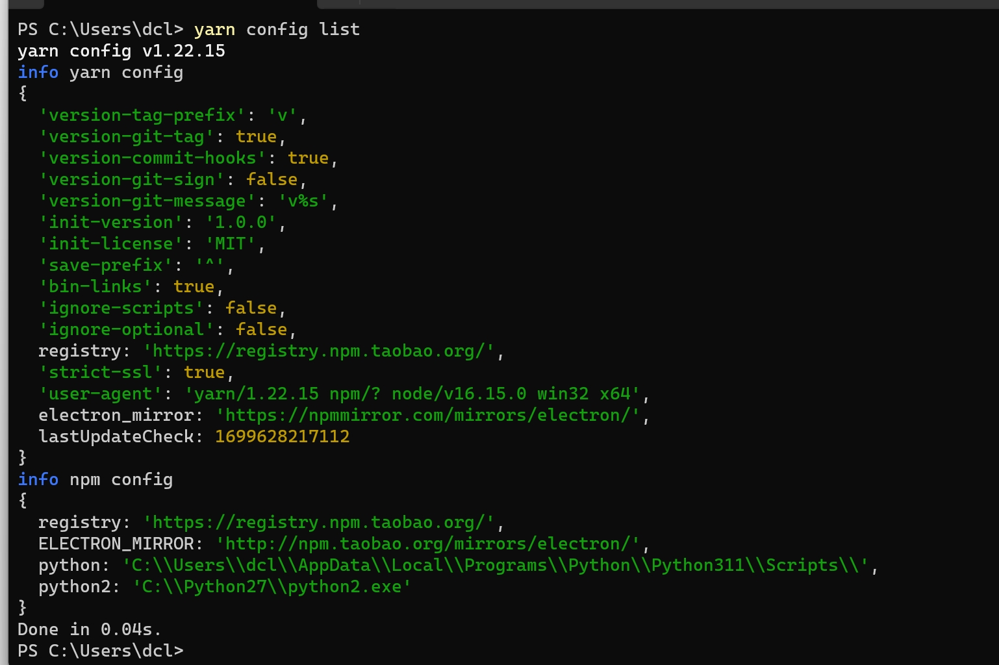
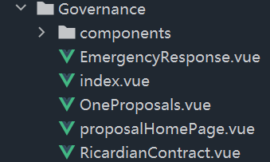

<!--
 * @Author: teddycode 1055334354@qq.com
 * @Date: 2023-10-31 18:05:17
 * @LastEditors: teddycode 1055334354@qq.com
 * @LastEditTime: 2023-11-09 20:50:09
 * @Description: 阅读项目文档
 * Copyright (c) 2023 by ${git_name_email}, All Rights Reserved.
-->

# 磐古OS APP说明文档

致力于构建一个打通区块链与互联网的多链跨链应用操作终端

本项目官方主页：[磐古跨链客户端官方主页](https://www.punkos.com)


## 总体架构



> 本文档为桌面应用介绍文档，后端文档参考这里[TODO]。


## 项目代码结构

```shell
├── api   // 自定义桌面模版
├── build // webpack打包脚本
├── css   // 样式资源 
├── db    // 本地数据库定义
├── dist  // 语言包打包资源
├── docs  // 项目文档
├── ext   // 第三方扩展包
├── icons // 图标资源包
├── img   // 一些图片包
├── js    // js脚本支持
├── localization // 多语言支持 
├── main  // 主进程代码
├── packages // 第三方支持包
│   ├── dragula
│   ├── electron-chrome-context-menu
│   ├── electron-chrome-extensions  // chrome插件
│   ├── loudness
│   ├── spotlight
│   ├── vue-shepherd
│   └── wallpaper
├── pages  // 主进程页面（底层是浏览器）
│   ├── apps
│   ├── appStore
│   ├── circle
│   ├── com
│   ├── download
│   ├── error
│   ├── fav
│   ├── globalSearch
│   ├── group
│   ├── guide
│   ├── import
│   ├── lanuchBar
│   ├── messageCenterSetting
│   ├── mobile
│   ├── mvideo
│   ├── newtab
│   ├── pdfViewerFull
│   ├── phishing
│   ├── prompt
│   ├── saApp
│   ├── selectTask
│   ├── sessionRestoreError
│   ├── settings
│   ├── sidebar
│   ├── siteCard
│   ├── switch
│   ├── toolBar
│   ├── update
│   ├── user
│   ├── userScript
│   └── util
├── reader  // 未知
├── res     // 二进制资源包
├── resources  // 脚本资源包
├── scripts // 开发构建脚本
├── src     // 主程序代码包
│   ├── api
│   ├── appPreload
│   ├── appWatch
│   ├── browserApi
│   ├── main // 又是js代码包
│   ├── model // 主进程存储相关
│   ├── preload
│   ├── rpc
│   ├── tableApi // 封装的桌面功能接口定义
│   ├── tsApi  // 封装的接口定义
│   ├── util  
│   └── watchPreload
├── tsbSdk // 未知sdk
└── vite   // 桌面进程代码
    ├── dist // 编译打包的资源
    ├── html // 静态html
    ├── packages // 第三方依赖包
    │   ├── app
    │   ├── barrage
    │   ├── extension
    │   ├── frame
    │   ├── icon
    │   ├── index
    │   ├── kee
    │   ├── search
    │   ├── selectIcon
    │   ├── settings
    │   ├── table // 桌面主要页面逻辑
    │   ├── task
    │   ├── toolbox
    │   ├── tray
    │   └── user
    ├── public // 公共文件
    ├── script // 开发脚本支持
    └── src // 未知代码区
   

```


## 开发调试

1.安装nodejs-16版本（建议使用nvm管理node版本，亲测node16.15.0对本项目正常使用）

2.在管路员终端安装win sdk工具`npm install --g --production windows-build-tools`

3.安装python3.10或以上版本，并设置yarn环境变量
> 参考可运行的完整yarn环境变量

项目推荐使用的环境变量：
```shell
electron_mirror=https://npm.taobao.org/mirrors/electron/
ELECTRON_BUILDER_BINARIES_MIRROR=http://npm.taobao.org/mirrors/electron-builder-binaries/
node_sqlite3_binary_host_mirror=http://npm.taobao.org/mirrors/
sass_binary_site=https://npm.taobao.org/mirrors/node-sass/
PYTHON_MIRROR=http://npm.taobao.org/mirrors/python
profiler_binary_host_mirror=http://npm.taobao.org/mirrors/node-inspector/
registry=https://registry.npm.taobao.org
```

4.在根目录运行yarn命令

5.在vite目录运行yarn命令

6.vite下执行`yarn run build`编译一遍

7.复制一个/node_modules下的dragula/dist/dragula.css 到 dragula/dist/dragula.min.css，不然会报这个库缺文件

## 启动项目

0.hosts下添加映射

C:\Windows\System32\drivers\etc\hosts 注意这个文件不能带.txt扩展名，否则不生效
注意，是每行一个。MD解析可能混在一行上了
```shell
127.0.0.1 table.com

127.0.0.1 1.table.com

127.0.0.1 2.table.com

127.0.0.1 3.table.com

127.0.0.1 4.table.com

127.0.0.1 5.table.com

127.0.0.1 6.table.com
```

验证方式，使用cmd ping table.com，响应127.0.0.1 ip数据包

注意：代理要排除这个域名，否则可能导致无法打开

1./vite yarn run start  在/vite目录下执行yarn run start命令，启动渲染进程

2./ yarn run start 在/根目录下执行yarn run start 启动electron客户端


## 打包桌面客户端

在根目录运行yarn run packageWin

## 协作指南

约定一些规范,制订相关流程，便于高效协作开发。

### 1. 代码提交规范

即`git commit`
中写的message信息规范，规范的提交信息有利于代码迭代的可读性，请参阅[约定式提交规范](https://zhuanlan.zhihu.com/p/90281637)

### 2. 代码命名规范

- 对于js代码文件，命名尽量一个单词搞定，如`preload.js`，若有歧义再采用小写开头的匈牙利命名方式，如`fileManager.js`
  ，尽可能简洁易懂，如果双单词命名过多，说明需要划分功能模块了。
- 对于vue页面代码，均放在views下，每个模块名均以大写开头的匈牙利命名方式，如`Collections`,尽可能单个单词完成命名。

### 3. 代码结构规范

- 对于js和vue代码，一个模块的实现对应一个文件夹，文件夹内的主文件应命名为`index.js / index.vue`, 文件夹内其他js文件命名遵循命名规范。
- 对于一个vue页面模块，如治理组页面模块，允许在模块内的components文件夹下自定义新组件，参考以下结构：



- `/renderer`文件夹下的`/api、/router、/store`均采用模块化方式组织代码结构，小组更新代码请在对应的模块下完成更新。

### 4. 小组页面开发流程

- **新建页面代码**： 在`/views/` 目录下寻找本组的文件夹，创建`index.vue`作为小组主界面，完成页面逻辑。
- **新建状态存储**:  在`/store/modules/`下对应的小组状态文件,添加状态信息。
- **新建页面路由**： 在`/router/modules/` 下对应的小组路由文件，创建一级或二级路由信息。
- **新建接口定义**： 如需要后端提供数据，请在`/api/`下按照现有示例添加本组API接口，遵循RESTFUL接口规范。
- **新建模拟数据**： 如有接口但是后端尚未实现，请在`/mock/`下按照现有示例添加本组的模拟接口，实现模拟数据返回。


## 常见问题解决
1. 问题：npm/yarn下载依赖失败或速度慢

- 解决: (1)删除文件`rm yarn.lock & rm package-lock.json` (2) 更换源 `npm/yarn config set registry https://registry.npmmirror.com/`

2. 问题：electron依赖下载失败
- 解决：添加单独的代理 `npm/yarn config set electron_mirror=https://cdn.npmmirror.com/binaries/electron/` 
   以及 `npm/yarn config set electron_builder_binaries_mirror=https://npmmirror.com/mirrors/electron-builder-binaries/`
3. 问题：sqlite3模块安装失败
- 解决：在管理员终端安装win-build-tools，参考[博客](https://blog.csdn.net/zhuijingtang2714/article/details/134148372?spm=1001.2014.3001.5501)
4. 问题：TS文件中引入vue报错提示can not find modules or its corresponding type
- 解决：在webstorm中打开`File | Settings | Languages & Frameworks | TypeScript` 将TypeScript version 选择到 4.8.4以上，参考[这里](https://youtrack.jetbrains.com/issue/WEB-60908/Typescript-service-doesnt-recognise-Vue-files-in-Typescript-5#focus=Comments-27-7313266.0-0)
## 开源引用说明

本项目基于一些开源组件开发而成。最底层是基于Electron的Min浏览器，这是一个多标签浏览器，我们在此基础上增加了大量的优化和开发。

包括开发了多功能左侧栏、标签组空间、密码管理器、收藏夹等等大量功能。

其中浏览器插件部分，引用了一个基于AGPL的插件。大家可以自行查阅依赖，已经放置到/packages目录下了。

项目是磐古跨链客户端的客户端前端部分，是全部前端源码，基于开源AGPL3.0协议的[想天工作台](https://gitee.com/tsbrowser/xtui)，后端未开源。
