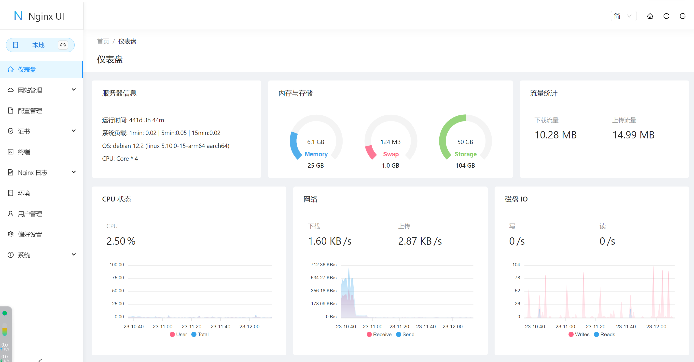
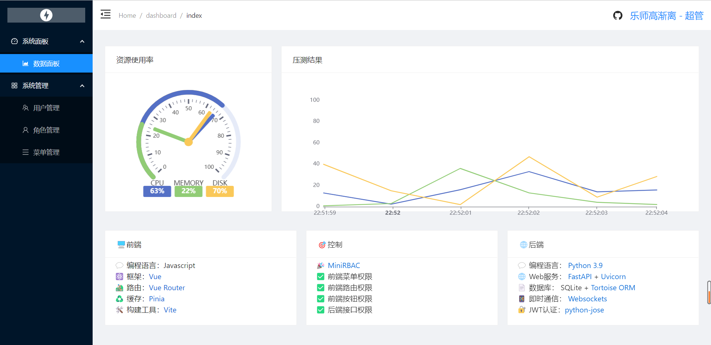

## 开源的 Antd 示例

1. Nginx UI: [code](https://github.com/0xJacky/nginx-ui) -- [preview](https://demo.nginxui.com/#/dashboard)
   
2. MiniRbac: [code](https://github.com/zy7y/mini-rbac) -- [preview]()
   
3. EECG BOOT 低代码开发平台 [code](https://github.com/jeecgboot/jeecgboot-vue3) -- [preview](http://boot3.jeecg.com/login?redirect=/dashboard/analysis)
4. 封装组件 ：https://github.com/lismill/vite2-vue3.x-typescript-framework/tree/main
5. CloudFish: [code](https://github.com/1esse/vue-clownfish-admin) -- [preview](https://jesse2hao.gitee.io/vue-clownfish-admin/#/dashboard)
6. 运维管理： [code](https://github.com/dromara/Jpom) -- [preview]()
7. 文件管理 [code](https://github.com/gaozhangmin/aliyunpan)
